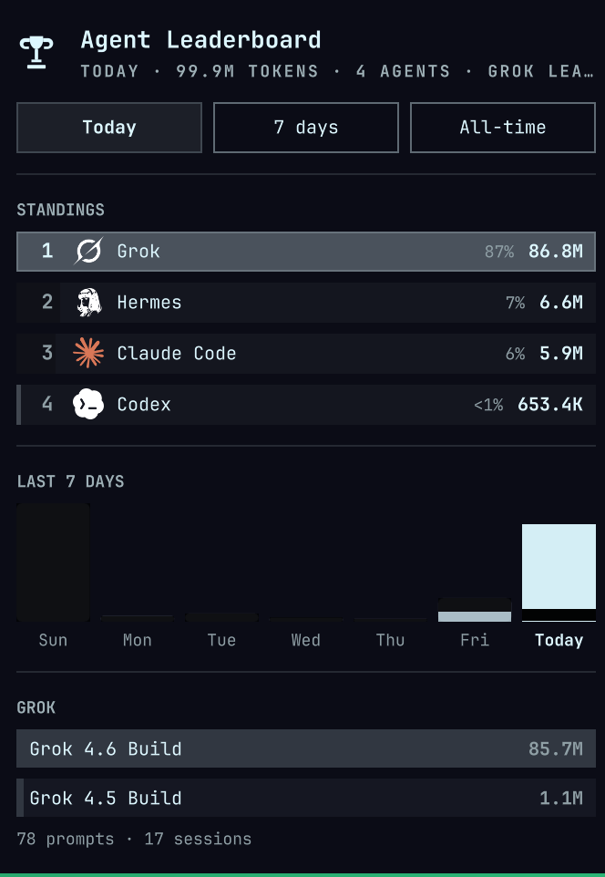

# Omarchy Agents

Dashboards and bar widgets for tracking AI coding-agent usage on [Omarchy](https://omarchy.org).

- **Web dashboard** (`apps/web`) — a local-first Bun + Hono + React + SQLite console with provider standings, trends, redacted transcript search, and a citation-bound local analyst. A Cloudflare Access–gated limits portal ranks session, weekly, and monthly allowances across subscriptions, counts down to each refresh, prices tasks at reference API rates, and recommends which platform to run next. Remotely reachable through Cloudflare Tunnel with Access-gated authentication — see it running at [agents.harlanljones.com](https://agents.harlanljones.com).
- **Agent leaderboard** (`apps/omarchy-agent-leaderboard`) — Omarchy bar widget ranking token usage across every coding agent on the machine. Forked from `mustafaokur.agent-leaderboard` (MIT).
- **Agent usage** (`apps/omarchy-agent-usage`) — fork of Omarchy's first-party Agents widget focused on per-provider usage and limits.
- **Provider assets** (`packages/provider-assets`) — single source for provider marks; each app consumes them through a repository-relative symlink, and plugin builds dereference the link so deployed plugin directories stay self-contained.

## Screenshots

<p align="center">
  <table>
    <tr>
      <td align="center">
        
        <br><sub>Web dashboard — standings, coverage, and the local analyst</sub>
      </td>
      <td align="center">
        
        <br><sub>Agent Leaderboard bar widget</sub>
      </td>
    </tr>
  </table>
</p>

## Requirements

- [Omarchy](https://omarchy.org) (Arch Linux + Hyprland) for the widgets
- [Bun](https://bun.sh) 1.4+
- [Ollama](https://ollama.com) for the local analyst

## Getting started

```bash
bun install
bun run check        # test + typecheck + build across the workspace
bun run dev --filter=@omarchy-agents/web
```

The dashboard serves `http://127.0.0.1:4317`. It indexes local Claude, Codex, Cline, Antigravity, OpenCode, Fireworks, and usage-collector stores; secret-like content is redacted before anything is persisted.

To install the bar widgets locally:

```bash
bun run deploy:local   # builds plugins into ~/.config/omarchy/plugins/
```

## Remote access

`apps/web/deploy/executable_provision-cloudflare.sh` provisions a remotely managed Cloudflare Tunnel, DNS route, OTP identity provider, a self-hosted Access application, and an allow policy for one email — plus two additional path-scoped admin Access applications (`/limits` and `/api/limits`) that gate the limits portal. See [apps/web/README.md](apps/web/README.md) for the required environment variables.

Loopback traffic stays unauthenticated; remote requests require a valid Cloudflare Access JWT scoped to your team, audience, and allow-listed email.

## Repository boundary

Chezmoi owns the systemd units, untracked environment files, Omarchy/Cline settings, usage collector overrides, and the after-apply hook that invokes this workspace. Secrets never live in this repository — see [docs/chezmoi-boundary.md](docs/chezmoi-boundary.md).

## License

[MIT](LICENSE). The leaderboard app carries its upstream notices in [apps/omarchy-agent-leaderboard/LICENSE](apps/omarchy-agent-leaderboard/LICENSE).
