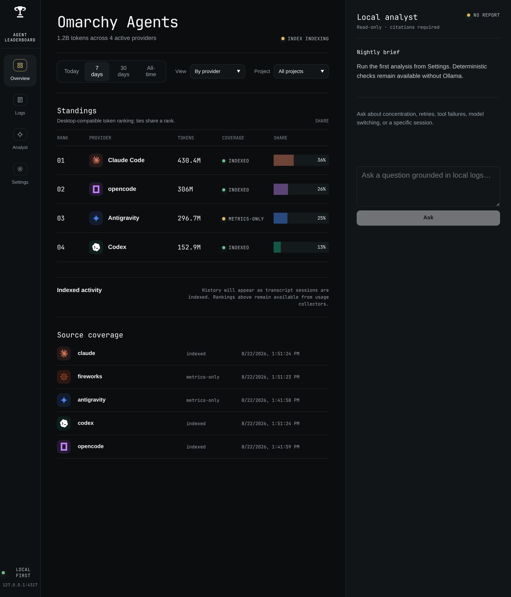

# Omarchy Agents Dashboard

Private local dashboard for Omarchy agent usage and transcript evidence.

This app is developed from the workspace root. Use `bun run dev --filter=@omarchy-agents/web` for development and `bun run check` for the full workspace verification.

## Screenshot



The dashboard combines local usage indexing, provider comparisons, transcript evidence, and the citation-bound analyst in one view.

## Local setup

From a fresh clone of the workspace:

```bash
bun install
bun run check                          # test + typecheck + build
bun run dev --filter=@omarchy-agents/web
```

Open `http://127.0.0.1:4317`. The first index runs in the background and metrics remain available while transcript indexing progresses. Secret-like content is redacted before anything is persisted.

Maintenance commands:

```bash
bun --filter=@omarchy-agents/web run index     # one-shot re-index
bun --filter=@omarchy-agents/web run analyze   # index, then a nightly analyst report
```

The analyst needs [Ollama](https://ollama.com) running locally; model selection is controlled by `OLLAMA_MODEL` and `OLLAMA_FALLBACK_MODEL` — see [deploy/dashboard.env.example](deploy/dashboard.env.example).

Production-style launches (dashboard service, analysis timer, Ollama unit, tunnel service) are managed outside this repository through chezmoi-owned systemd units — see [docs/chezmoi-boundary.md](../../docs/chezmoi-boundary.md).

## Remote setup

Create a scoped Cloudflare API token with Tunnel, DNS, Access application/policy, and Access identity-provider write permissions. Export `CLOUDFLARE_API_TOKEN`, `CLOUDFLARE_ACCOUNT_ID`, `CLOUDFLARE_ZONE_ID`, `DASHBOARD_HOSTNAME` (the tunnel hostname, e.g. `agents-api.example.com`), and `ACCESS_EMAIL`, then run `deploy/executable_provision-cloudflare.sh`. It creates or updates the remotely managed tunnel, published route, proxied DNS record, OTP identity provider, self-hosted Access application, and allow policy for `$ACCESS_EMAIL`.

Two hostnames play distinct roles. The tunnel hostname (`API_HOSTNAME`) is the Access-protected origin the Worker proxies to with a service token; the browser-facing hostname (`DASHBOARD_HOSTNAME`, e.g. the Worker's custom domain) is where people browse. Setting both to the same value disables service authentication by design. Set `DASHBOARD_HOSTNAME` in `~/.config/omarchy-agents/dashboard.env` so the server accepts the remote host.

Add the Cloudflare Access team name to `~/.config/omarchy-agents/dashboard.env`, then enable `omarchy-agents-tunnel.service`. Both environment files must stay mode `0600`; the provisioning script writes the tunnel token there and never into chezmoi.

## Limits portal

The `/limits` page and its `/limits/api/*` endpoints are admin-only, and they live on the tunnel hostname: the Worker redirects `/limits*` on the browser-facing host to `$API_ORIGIN/limits`, because service identities can never open the portal. The tunnel hostname sits behind a single Access application covering the page, its assets, and its API — separate applications per path cannot share browser sessions, which used to leave the portal's subresources blocked. The provisioning script deletes any legacy path-scoped applications and writes the application audience to `CLOUDFLARE_ACCESS_ADMIN_AUD` in `dashboard.env`. Every portal request is verified against the team JWKS with the same issuer/email checks as the rest of the host; requests without a valid token get `401`, tokens for a non-admin audience get `401`, and service tokens (identified by their `common_name` claim) get `403` on any host. When `CLOUDFLARE_ACCESS_ADMIN_AUD` is unset the routes fail closed, including on loopback.

The advisor ranks platforms by binding headroom (smallest session/weekly/monthly window), prices tasks at reference API rates, and always-on suggests where to run next. Task presets are small (~250k), medium (~1.5M), and large (~6M) tokens; explicit `input`, `output`, and `cacheRead` query parameters override them.

Pricing comes from a built-in table snapshot (`PRICING_AS_OF`) of reference per-token rates. To correct or extend it, create `~/.config/omarchy-agents/pricing.json` (or point `OMARCHY_AGENTS_CONFIG` at another file) mapping model names or prefixes to `{ input, output, cacheRead }` dollar rates per million tokens, or `null` to mark a model unpriced. Overrides take precedence over built-ins and appear tagged on the pricing page.

## Rollback

```bash
systemctl --user disable --now omarchy-agents-tunnel.service omarchy-agents-analysis.timer omarchy-agents-dashboard.service ollama-omarchy-agents.service
```

Disable or delete the Access applications and tunnel route in Cloudflare. Local indexed data remains at `~/.local/state/omarchy-agents/index.sqlite` until deliberately removed.
