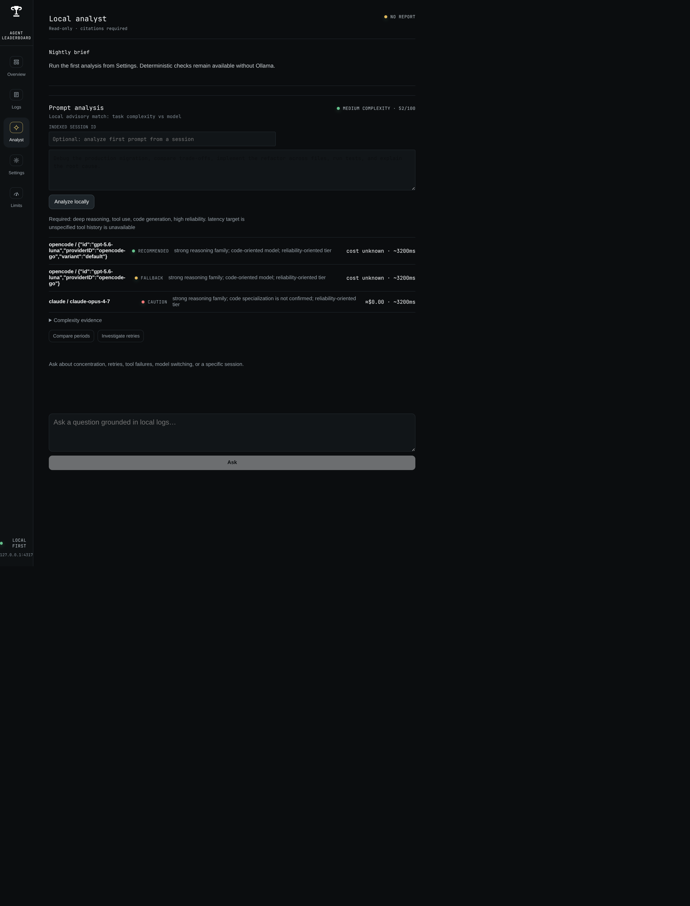
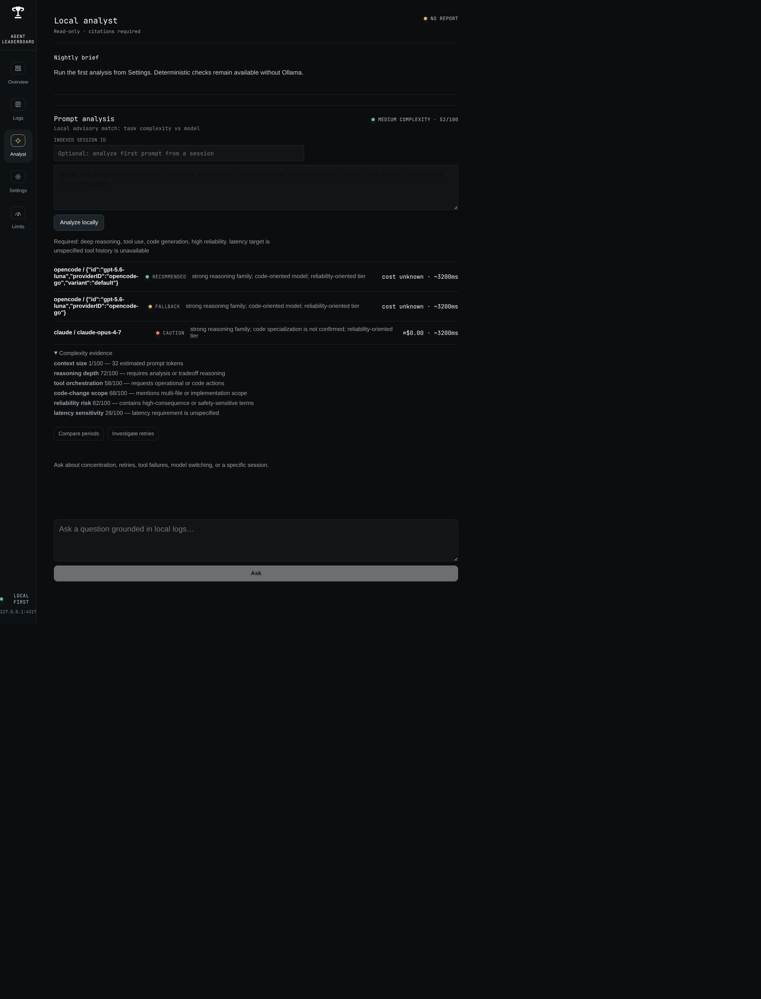
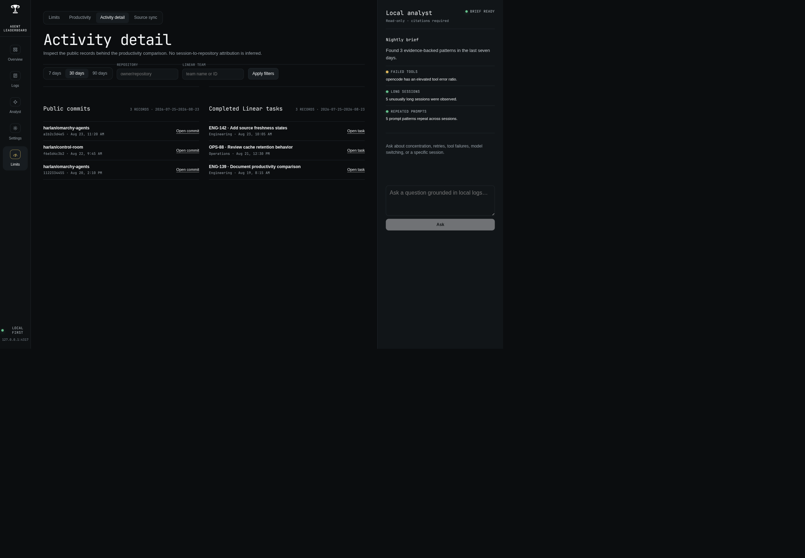
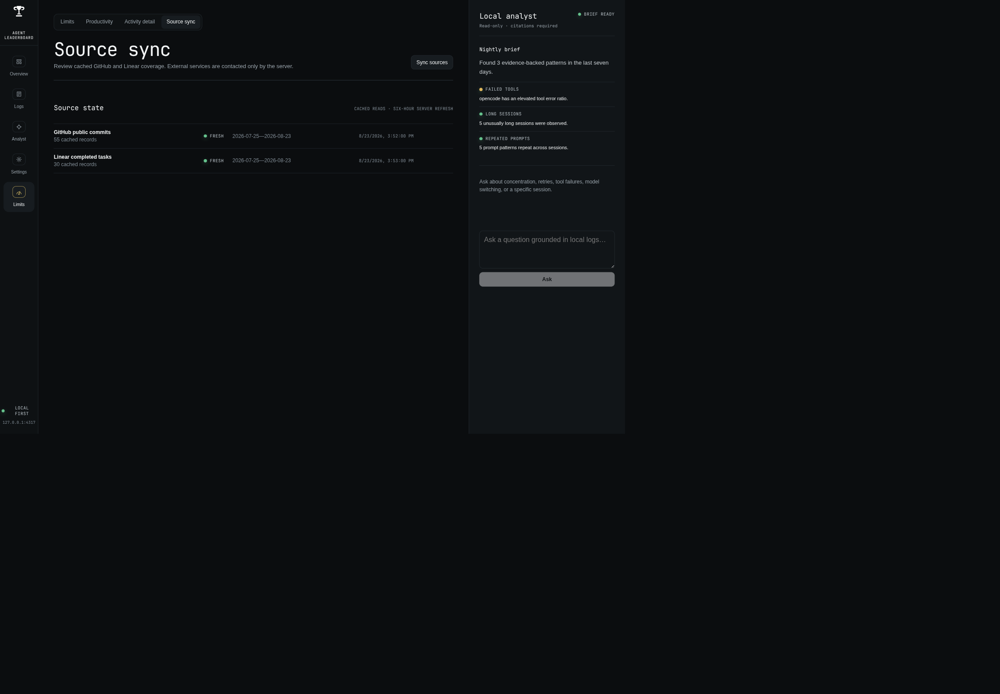

# Omarchy Agents Dashboard

Private local dashboard for Omarchy agent usage and transcript evidence.

This app is developed from the workspace root. Use `bun run dev --filter=@omarchy-agents/web` for development and `bun run check` for the full workspace verification.

## Screenshot










The dashboard combines local usage indexing, provider comparisons, transcript evidence, and the citation-bound analyst in one view.

### Limits and productivity portal

The admin-only `/limits` portal is organized as four tabs:

- **Limits** ranks subscription headroom and task fit using the existing collector records.
- **Productivity** compares canonical indexed token totals with daily public GitHub commits and completed Linear tasks. The ratios are descriptive and explicitly non-causal.
- **Activity detail** lists the cached public commit and completed-task records behind that comparison. It supports 7-, 30-, and 90-day ranges plus repository and Linear-team filters, and links to the public source records.
- **Source sync** reports GitHub and Linear configuration, cache freshness, coverage, rate limits, and errors. The **Sync sources** action runs on the server; browser page loads never call external APIs directly.

The portal automatically refreshes configured sources every six hours, syncs missing or stale caches at startup, and retains the last successful cache when a refresh fails. No session is matched to a repository or task, and no private task descriptions or raw API payloads are exposed to the browser.

### Prompt analysis

The Analyst page includes a local, advisory prompt analyzer. Paste a prompt or provide an indexed session ID; the analyzer redacts secrets, scores context size, reasoning depth, tool orchestration, code-change scope, reliability risk, and latency sensitivity, then ranks available models/providers as recommended, fallback, or caution. Results include capability evidence, known API cost, estimated latency, confidence, unknowns, and warnings when requirements conflict. It never changes agent configuration automatically.

## Local setup

From a fresh clone of the workspace:

```bash
bun install
bun run check                          # test + typecheck + build
bun run dev --filter=@omarchy-agents/web
```

Open `http://127.0.0.1:4317`. The first index runs in the background and metrics remain available while transcript indexing progresses. Secret-like content is redacted before anything is persisted.

Maintenance commands:

```bash
bun --filter=@omarchy-agents/web run index     # one-shot re-index
bun --filter=@omarchy-agents/web run analyze   # index, then a nightly analyst report
```

The analyst needs [Ollama](https://ollama.com) running locally; model selection is controlled by `OLLAMA_MODEL` and `OLLAMA_FALLBACK_MODEL` — see [deploy/dashboard.env.example](deploy/dashboard.env.example).

Production-style launches (dashboard service, analysis timer, Ollama unit, tunnel service) are managed outside this repository through chezmoi-owned systemd units — see [docs/chezmoi-boundary.md](../../docs/chezmoi-boundary.md).

## Remote setup

Create a scoped Cloudflare API token with Tunnel, DNS, Access application/policy, and Access identity-provider write permissions. Export `CLOUDFLARE_API_TOKEN`, `CLOUDFLARE_ACCOUNT_ID`, `CLOUDFLARE_ZONE_ID`, `DASHBOARD_HOSTNAME` (the tunnel hostname, e.g. `agents-api.example.com`), and `ACCESS_EMAIL`, then run `deploy/executable_provision-cloudflare.sh`. It creates or updates the remotely managed tunnel, published route, proxied DNS record, OTP identity provider, self-hosted Access application, and allow policy for `$ACCESS_EMAIL`.

Two hostnames play distinct roles. The tunnel hostname (`API_HOSTNAME`) is the Access-protected origin the Worker proxies to with a service token; the browser-facing hostname (`DASHBOARD_HOSTNAME`, e.g. the Worker's custom domain) is where people browse. Setting both to the same value disables service authentication by design. Set `DASHBOARD_HOSTNAME` in `~/.config/omarchy-agents/dashboard.env` so the server accepts the remote host.

Add the Cloudflare Access team name to `~/.config/omarchy-agents/dashboard.env`, then enable `omarchy-agents-tunnel.service`. Both environment files must stay mode `0600`; the provisioning script writes the tunnel token there and never into chezmoi.

## Limits portal

The `/limits` page and its `/limits/api/*` endpoints are admin-only, and they live on the tunnel hostname: the Worker redirects `/limits*` on the browser-facing host to `$API_ORIGIN/limits`, because service identities can never open the portal. The tunnel hostname sits behind a single Access application covering the page, its assets, and its API — separate applications per path cannot share browser sessions, which used to leave the portal's subresources blocked. The provisioning script deletes any legacy path-scoped applications and writes the application audience to `CLOUDFLARE_ACCESS_ADMIN_AUD` in `dashboard.env`. Every portal request is verified against the team JWKS with the same issuer/email checks as the rest of the host; requests without a valid token get `401`, tokens for a non-admin audience get `401`, and service tokens (identified by their `common_name` claim) get `403` on any host. When `CLOUDFLARE_ACCESS_ADMIN_AUD` is unset the routes fail closed, including on loopback.

The advisor ranks platforms by binding headroom (smallest session/weekly/monthly window), prices tasks at reference API rates, and always-on suggests where to run next. Task presets are small (~250k), medium (~1.5M), and large (~6M) tokens; explicit `input`, `output`, and `cacheRead` query parameters override them.

Pricing comes from a built-in table snapshot (`PRICING_AS_OF`) of reference per-token rates. To correct or extend it, create `~/.config/omarchy-agents/pricing.json` (or point `OMARCHY_AGENTS_CONFIG` at another file) mapping model names or prefixes to `{ input, output, cacheRead }` dollar rates per million tokens, or `null` to mark a model unpriced. Overrides take precedence over built-ins and appear tagged on the pricing page.

`/limits?view=productivity` opens the Productivity tab and `/limits?view=activity` opens Activity detail. Configure `PRODUCTIVITY_GITHUB_OWNER`, `PRODUCTIVITY_GITHUB_OWNER_TYPE` (`user` or `org`), optional comma-separated `PRODUCTIVITY_GITHUB_REPOS`, `LINEAR_API_KEY`, comma-separated `PRODUCTIVITY_LINEAR_TEAM_IDS`, and optional `PRODUCTIVITY_TIME_ZONE` (defaults to `America/Los_Angeles`) in `dashboard.env`. The ignored `.linear.toml` file is not read by the application. Page loads remain cache-only; the server refreshes configured sources every six hours (and immediately at startup when the cache is missing or stale), while the admin-only **Sync sources** action refreshes them on demand. A failed source refresh retains its last successful cache and reports the source as stale, rate-limited, or unavailable.

## Rollback

```bash
systemctl --user disable --now omarchy-agents-tunnel.service omarchy-agents-analysis.timer omarchy-agents-dashboard.service ollama-omarchy-agents.service
```

Disable or delete the Access applications and tunnel route in Cloudflare. Local indexed data remains at `~/.local/state/omarchy-agents/index.sqlite` until deliberately removed.
